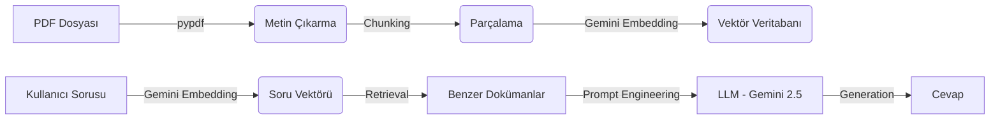

# ⚖️ Kat Mülkiyeti Kanunu Asistanı (Legal-RAG)

Bu proje, **Kat Mülkiyeti Kanunu** hakkında soruları yanıtlayan, yapay zeka destekli bir **RAG (Retrieval-Augmented Generation)** asistanıdır.

**Amaç:** Karmaşık hukuki metinleri herkesin anlayabileceği sade bir dille açıklamak ve kanun maddelerine dayalı güvenilir cevaplar üretmek.

---

## 🌟 Özellikler

- **📄 PDF Entegrasyonu:** Kanun metnini doğrudan PDF dosyasından okur ve işler.
- **🧠 Akıllı Arama:** Sorunuzla ilgili en alakalı kanun maddelerini bulur (Semantic Search).
- **🤖 Gelişmiş Yapay Zeka:** Google Gemini 2.0 Flash modeli ile doğal ve akıcı cevaplar üretir.
- **⚖️ Kanıtlı Cevaplar:** Her cevabın altında hangi maddelerden yararlanıldığı gösterilir.
- **🎨 Modern Arayüz:** Streamlit ile geliştirilmiş, kullanıcı dostu web arayüzü.
- **🇹🇷 Tam Türkçe Desteği:** Türkçe metinler için optimize edilmiş arama ve üretim.

---

## 🏗️ Mimari ve Çalışma Prensibi (Teknik Detaylar)

Bu sistem, modern bir **RAG (Retrieval-Augmented Generation)** mimarisi kullanır. İşleyiş adım adım şöyledir:



### 1. Veri Hazırlığı (Ingestion)
*   **PDF Okuma:** `pypdf` kütüphanesi ile `kat-mulkiyeti-kanunu.pdf` okunur.
*   **Chunking (Parçalama):** Metin, hukuki bütünlüğü koruyacak şekilde parçalara ayrılır (`RecursiveCharacterTextSplitter`).
    *   *Chunk Size:* 2000 karakter
    *   *Overlap:* 400 karakter (bağlam kopmaması için)
*   **Embedding (Vektörleştirme):** Her parça, **Google Gemini Embeddings** (`models/gemini-embedding-001`) ile sayısal vektörlere dönüştürülür. Bu model, Türkçe'nin anlamsal yapısını çok iyi kavrar.
*   **Vector Store:** Vektörler **ChromaDB** yerel veritabanında saklanır.

### 2. Cevap Üretimi (Inference)
*   **Soru Analizi:** Kullanıcının sorusu da aynı embedding modeli ile vektöre çevrilir.
*   **Retrieval (Getirme):** Vektör veritabanından soruya en çok benzeyen **15 doküman** getirilir (`k=15`).
> ✅ **Bilgi:** Proje, **hazır vektör veritabanı** (`chroma_db/`) ile birlikte gelir. İlk çalıştırmada bekleme süresi yoktur; uygulama anında açılır.
>
> Sadece PDF dosyasını değiştirirseniz `make ingest` komutuyla veritabanını yenilemeniz gerekir.
    *   *Deduplication:* Aynı içeriğe sahip mükerrer dokümanlar temizlenir.
*   **Prompt Engineering:** LLM'e özel bir talimat seti (System Instruction) verilir:
    *   "Sadece bu metni kullan"
    *   "Madde numarasını tespit et"
    *   "Hukuki terimleri sadeleştir"
*   **Generation:** **Google Gemini 2.0 Flash** modeli, sağlanan bağlamı ve talimatları kullanarak cevabı üretir. SDK olarak direkt `google.generativeai` kullanılır (Hız ve stabilite için).

---

## 🚀 Kurulum ve Çalıştırma

### Gereksinimler
- Python 3.10 veya üzeri (Önerilen: 3.12)
- Google API Anahtarı (Gemini için)

### Adım 1: Projeyi Hazırla
```bash
# Sanal ortam oluştur
python -m venv .venv

# Aktif et (Linux/Mac)
source .venv/bin/activate
# Aktif et (Windows)
# .venv\Scripts\activate

# Paketleri yükle
pip install -r requirements.txt
```

### Adım 2: API Anahtarını Ayarla
`.env.example` dosyasının adını `.env` olarak değiştirin ve anahtarınızı ekleyin:
```
GEMINI_API_KEY=AIzaSy...
```

### Adım 3: Uygulamayı Başlat
```bash
streamlit run app.py
```
Tarayıcınızda otomatik olarak açılacaktır (`http://localhost:8501`).

### ⚡ Kısayol Komutları (Makefile)

Projeyi terminalden daha hızlı yönetmek için şu komutları kullanabilirsiniz:

| Komut | Açıklama |
|-------|----------|
| `make setup` | Gerekli paketleri `requirements.txt` üzerinden yükler. |
| `make run` | Uygulamayı başlatır. |
| `make ingest` | Veritabanını siler ve sıfırdan oluşturur (PDF değişikliğinde kullanın). |
| `make clean` | Geçici dosyaları temizler. |

---

## 🛠️ Tech Stack

| Teknoloji | Amaç | Neden Seçildi? |
|-----------|------|----------------|
| **Python** | Programlama Dili | AI/ML ekosistemi için standart. |
| **Streamlit** | Web Arayüzü | Hızlı prototipleme, temiz UI. |
| **LangChain** | RAG Framework | Belge işleme ve vektör DB yönetimi kolaylığı. |
| **Google Gemini** | LLM & Embedding | Yüksek Türkçe performansı, geniş bağlam penceresi, ücretsiz katman. |
| **ChromaDB** | Vektör Veritabanı | Kurulum gerektirmeyen, hafif, yerel çözüm. |
| **pypdf** | PDF İşleme | Hızlı ve güvenilir metin çıkarma. |

---

## 🔮 Future Work

Bu proje şu anda temel bir RAG uygulamasıdır. İleri seviye özellikler için şunlar planlanmaktadır:

### 1. MCP (Model Context Protocol) Entegrasyonu
Antropic tarafından geliştirilen açık standart.
- **ChromaDB MCP Server:** Veritabanına standart bir arayüzle erişim.
- **Multi-Source RAG:** İçtihatlar, Yargıtay kararları gibi harici kaynakların kolayca eklenmesi.
- **AI Tool Calling:** LLM'in veritabanını kendi kendine sorgulaması.

### 2. Multi-Agent Sistemler (OpenAI Swarm)
Tek bir asistan yerine, uzmanlaşmış ajanlar:
- **Araştırmacı Ajan:** Kanun maddelerini bulur.
- **Yorumlayıcı Ajan:** Maddeleri günlük dile çevirir.
- **Denetçi Ajan:** Cevabın doğruluğunu kontrol eder.

### 3. Gelişmiş Arayüz (Mastra + Vercel AI)
- **Streaming Responses:** Cevabın yazılırken ekranda belirmesi (daktilo efekti).
- **Sohbet Geçmişi:** Önceki soruların hatırlanması.

---

## ⚠️ Yasal Uyarı
Bu uygulama eğitim ve bilgilendirme amaçlıdır. Üretilen içerikler **hukuki tavsiye niteliği taşımaz**. Resmi işlemleriniz için lütfen bir avukata danışınız.